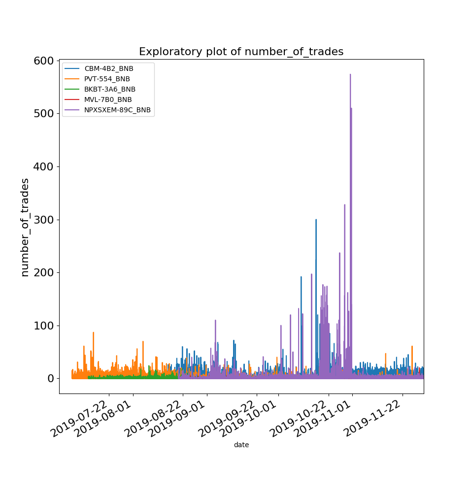
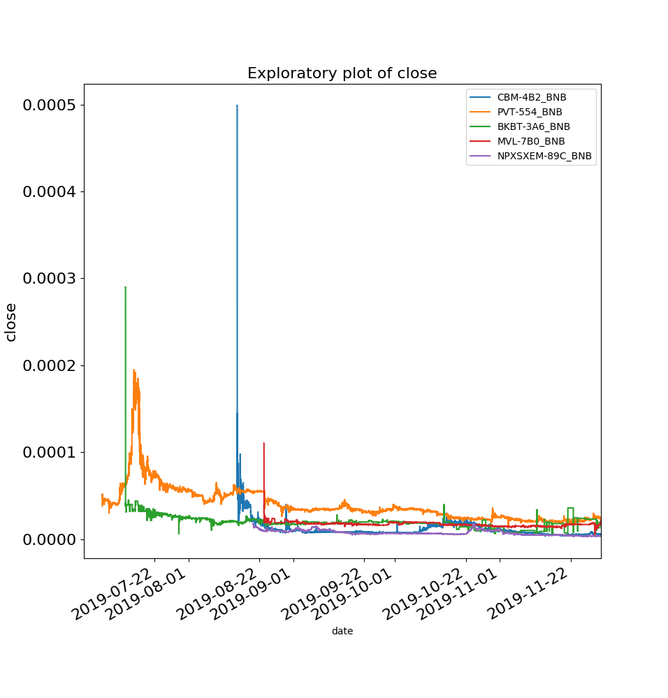

# BEP-2 Stablecoin

The aim of this project is to examine BEP2 tokens on the Binance Blockchain.
In particular, the liquidity and volatility of these assets, and whether combinations of these assets may afford lower volatility. 

# Section 1: project structure

## /data

Folder that stores the data, in pickle file format.

## /engine

Folder that stores the main functions that are used for the analysis. In particular:

### binance_chain.py

This file contains functions that retrieve all the tokens from the Binance-Chain, get all the markets on the Binance Chain.
Most importantly the file contains the function **get_all_1m_klines()**, a file which extracts all of the data from the Binance Chain at 1-minute frequency. 

## generic_functions.py

This file contains generic functions that are used to support the analysis elsewhere. 

## portfolio_functions.py

This file contains a variety of functions that compute the performance of different baskets of BEP-2 cryptoassets.

## **/scripts**

### data_cleaning.py

This file contains functions for (i) loading in the pickled data file, (ii) selecting a basket of assets based on volume (as a proxy for liquidity), (iii) plotting of variables of interest within the imported data - and other functions too. 

### stability_of_basket.py

This purpose of the analysis in this file is to understand how much variability there is in the composition of the stablecoin basket.
For instance, if the 5 largest assets by volume are selected in one month, how many of these assets would be selected using data from the next month?

### weights_variation.py

This file demonstrates how much the weights would change if the weights are optimized to minimize variance every day (gives a sense of how volatile the assets are intra-day).
These weights are derives my minimizing the variance through simulation, as shown in the following figure. 

### stablecoin.py

This is the main file, which shows how the volatility (returns) can be dampened / smoothed by selecting a basket of assets that minimize the variance. 

# Section 2: Results

## Liquidity plots (volume and number of trades)

### Volumes of the top 5 assets by volume over the period 01 July to 30 Nov

### Number of trades of the top 5 assets by volume over the period 01 July to 30 Nov

### (Close) price of the top 5 assets by volume over the period 01 July to 30 Nov

## Stability of basket membership

There appears to be significant volatility in terms of the membership of assets to the basket, with many pairs joining and leaving the top 10. Therefore the analysis mainly focusses on the top 5 assets by volume to keep the basket composition stable.

In July, new larger volume symbols are ['PVT-554_BNB', 'BKBT-3A6_BNB', 'ERD-D06_BNB', 'MEETONE-031_BNB']

In Aug, new larger volume symbols are ['CBM-4B2_BNB', 'KAT-7BB_BNB']

In Sept new larger volume symbols are ['MVL-7B0_BNB', 'NPXSXEM-89C_BNB']

In Oct new larger volume symbols is ['KAT-7BB_BNB']

**The basket for the period 1 July - 30 Nov (used in the analysis) is ['CBM-4B2_BNB', 'PVT-554_BNB', 'BKBT-3A6_BNB', 'MVL-7B0_BNB', 'NPXSXEM-89C_BNB']**

## Stability of weights for a fixed basket of assets

We opt for the asset basket ['CBM-4B2_BNB', 'PVT-554_BNB', 'BKBT-3A6_BNB', 'MVL-7B0_BNB', 'NPXSXEM-89C_BNB'], since these have the highest volume over the period 1 July - 30 Nov.

Finding the optimum weights for minimum variance can be done through the simulating random portfolios and inspecting the efficient frontier.
See the following figure.  

Resulting in weights with the following daily variability over the 1 July to 30 Nov period.

Three methods for a basket of stable-assets are compared: (i) equal weighting (a naive portfolio); (ii) using weights from random sampling and (iii) minimizing the weights using SciPy. 
See the following figure.

**It shows a significant reduction in the volatility of returns for a stablecoin-basket where weights are used.**

For the following figure the weights are chosen to minimize the variance over the period 1 July to 30 Nov, and are as follows. 

CBM-4B2 - 0.077092
PVT-554 - 0.230077
BKBT-3A6 - 0.030297
MVL-7B0 - 0.442056
NPXSXEM-89C - 0.220478

